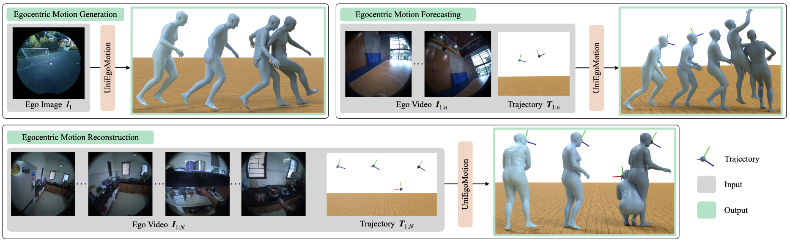

# UniEgoMotion
This repository provides the dataset and code for the following paper: 
```
UniEgoMotion: A Unified Model for Egocentric Motion Reconstruction, Forecasting, and Generation
Chaitanya Patel, Hiroki Nakamura, Yuta Kyuragi, Kazuki Kozuka, Juan Carlos Niebles, Ehsan Adeli
ICCV 2025  
```
[[Project Website](https://chaitanya100100.github.io/UniEgoMotion)]
[[ArXiv](https://arxiv.org/abs/2508.01126)]



## Citation
Cite us if you use our model, code or data:
```
@inproceedings{patel25uniegomotion,
  title     = {UniEgoMotion: A Unified Model for Egocentric Motion Reconstruction, 
               Forecasting, and Generation},
  author    = {Patel, Chaitanya and Nakamura, Hiroki and Kyuragi, Yuta and 
               Kozuka, Kazuki and Niebles, Juan Carlos and Adeli, Ehsan},
  booktitle = {International Conference on Computer Vision (ICCV)},
  year      = {2025},
}
```

## Installation
The code is tested on Python 3.10, PyTorch 2.5.1, and CUDA 11.8 on a single L40S GPU. However, it should work on most modern GPUs with any recent PyTorch and CUDA version.
```
conda create --name uem python=3.10
conda activate uem

# Install Pytorch with your own CUDA version
pip3 install torch --index-url https://download.pytorch.org/whl/cu118

pip3 install pytorch_lightning==2.4.0
pip3 install -r requirements.txt
```
Download the SMPL-X model from [here](https://smpl-x.is.tue.mpg.de/) and set a proper path in `get_smpl` function in `dataset/smpl_utils.py`.

## EE4D-Motion Dataset
See `DATASET.md` to download and setup the dataset. This is required to run the model.

## Pretrained UniEgoMotion Model
Download the pretrained model from [here](https://downloads.cs.stanford.edu/simurgh/chpatel/uem_v4b_dinov2.zip) and place it in the `exp/` directory.

## Visualizing UniEgoMotion Outputs
Run the following command to visualize UniEgoMotion outputs on some validation samples for all three tasks.
```
python run/vis_uem.py \
CONFIG ./config/uem.yaml \
TRAIN.EXP_PATH ./exp/uem_v4b_dinov2/ \
MODEL.CKPT_PATH last_ckpt
```

## Training and Evaluating UniEgoMotion from Scratch
Run the following to train UniEgoMotion model. Use an appropriate experiment path to save training logs and model checkpoints.
```
python run/train_uem.py \
CONFIG ./config/uem.yaml \
TRAIN.EXP_PATH <exp_path>
```

Run the following command to evaluate UniEgoMotion model on the validation set. It will save the predictions for all three tasks in the experiment directory, and compute 3D and semantic metrics. You will need to setup TMR model through [this repo](https://github.com/nv-tlabs/stmc) and set the path in `model/tmr_eval_model.py`.
```
python eval/eval_exp.py \
CONFIG ./config/uem.yaml \
TRAIN.EXP_PATH <exp_path> \
MODEL.CKPT_PATH last_ckpt
```

Run the following command to visualize some saved predictions for a particular task.
```
python eval/vis_uem_preds.py \
--EXP_PATH <exp_path> \
--EVAL_TASK <task>
```

### Baselines and Ablations
Commands to train UniEgoMotion model and some ablation experiments:
- `python run/train_uem.py CONFIG ./config/uem.yaml TRAIN.EXP_PATH <exp_path>` for original UniEgoMotion model.
- Use `MODEL.ENCODER_TSFM add` to train transformer encoder baseline.
- Use `DATA.REPRE_TYPE v1_beta` to train with global motion representation. See `dataset.representation_utils.py` for the explanation of different motion representations. You will need to compute the statistics for this representation first. See `DATASET.md` for more details.
- Use `DATA.COND_IMG_FEAT False` to train without egocentric video conditioning i.e. only conditioned on egocentric trajectory.
- Use `DATA.IMG_FEAT_TYPE clip_all` to train with CLIP features instead of DINOv2. Note that you will need to extra CLIP features for all takes and collect them into one file per split. See `DATASET.md` for more details.

Commands to train baselines:
- `python run/train_uem.py CONFIG ./config/lstm.yaml TRAIN.EXP_PATH <exp_path> MODEL.LSTM_TYPE gen` to train LSTM baseline for egocentric motion generation. Use `MODEL.LSTM_TYPE fore` for forecasting baseline.
- `python run/train_uem.py CONFIG ./config/uem_traj.yaml TRAIN.EXP_PATH <exp_path>` to train UniEgoMotion trajectory prediction model (instead of whole body pose). The trajectory conditioned motion prediction model will be the original UniEgoMotion model. Use `CONFIG ./config/uem_twostage.yaml` with appropriate arguments for evaluation and visualization.


If you have any questions or concerns about the code or dataset, please open an issue.
